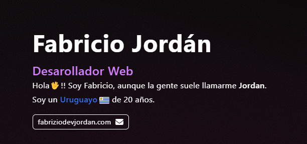

<h1 align="left">:vulcan_salute: Hola!, Soy Fabrizio</h1>

##
 Apasionado por el autodidactismo, los sistemas GNU/Linux y la programación.
 
 Además soy un:
- Desarrollador Frontend.
- Autodidacta.
- Uruguayo de 20 años.

  
  ## :link: Mis links
  
  
  

  ## :hammer_and_wrench: Lenguajes y herramientas que utilizo
  
  
  
  
  
  
  
  
  
  
  
  
  

## :person_curly_hair: Sobre mí

* :telescope: Admirador de los sistemas GNU/Linux y del Shell Scripting :computer:.

* :seedling: Actualmente estoy estudiando y practicando Astro y React, además de aprendiendo Python :muscle:.

* :heartbeat: Amante de los estudios :blue_book: y del autodidactismo.

* :mailbox: ¿Quieres contactar conmigo? 

## :desktop_computer: Mis proyectos:

<table>
<tr>
<td width="50%">
<h3 align="center">Prototipo de Portafolio</h3>

Un prototipo de <strong>portafolio personal</strong> hecho como practica con <strong>TailwindCSS</strong>. 🚀

                                                                                      
</td>       

<td width="50%">
<h3 align="center">Xiaomi Fake Web</h3>

Página web hecha para practicar <strong>componetización</strong> con <strong>JavaScript puro</strong> junto a <strong>TailwindCSS</strong>! 🔥

                                                                                      
</td>  
</table>       

## :fire: Mis estadísticas

 
Click para ver

  
  
 

 

](https://github.com/anuraghazra/github-readme-stats))
 

  
  

